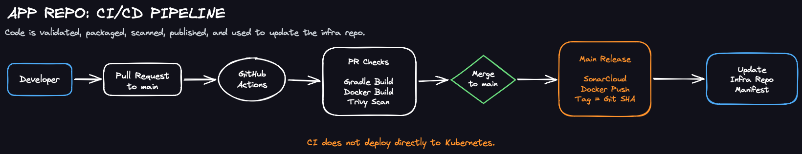

# E-Commerce DevOps Application

## Overview

This repository contains the application-side implementation for my E-Commerce DevOps portfolio project.

The project is based on the OpenTelemetry Demo. I selected three microservices from the original demo and rebuilt their delivery workflow with a DevOps-focused approach:

- Ad Service
- Product Catalog Service
- Recommendation Service

The goal is to demonstrate a practical CI/CD and GitOps delivery flow. Application code is validated, packaged into Docker images, scanned, published to Docker Hub, and then used to update Kubernetes manifests in a separate infrastructure repository.

The project uses a two-repository design:

- `e-commerce-devops-app`: application source code, Dockerfiles, GitHub Actions workflows, image build, image scan, and image publishing
- `e-commerce-devops-infra`: Terraform infrastructure code, Kubernetes manifests, Argo CD Applications, and GitOps desired state

This repository does not deploy directly to Kubernetes. Instead, it updates the desired state in the infra repository. Argo CD is responsible for synchronizing that desired state to AWS EKS.

## Architecture


## Current Status

The application CI/CD implementation has been completed for all three selected services.

| Service | Language | Image | CI/CD Status |
|---|---|---|---|
| Ad Service | Java / Gradle | `steveyang128/ad-service:<git-sha>` | Completed |
| Product Catalog Service | Go | `steveyang128/product-catalog-service:<git-sha>` | Completed |
| Recommendation Service | Python | `steveyang128/recommendation-service:<git-sha>` | Completed |

Current project status:

```text
Application CI/CD implementation: completed
Infra GitOps manifests: completed
Final EKS end-to-end validation: pending
```

The final EKS validation will verify that Terraform, Argo CD, Kubernetes manifests, the AWS Load Balancer Controller, and the three service deployment flow work together end to end.

## Repository Structure

```text
.github/
  workflows/
    ad-service-ci.yaml
    product-catalog-service-ci.yaml
    recommendation-service-ci.yaml
    sonarcloud-scan.yaml

src/
  ad/
    Dockerfile
    build.gradle
    settings.gradle
    src/
    pb/

  product-catalog/
    Dockerfile
    go.mod
    go.sum
    products/

  recommendation/
    Dockerfile
    requirements.txt
    recommendation_server.py
```

## CI/CD Workflow



Each service has its own GitHub Actions workflow. The workflows separate pull request validation from main-branch release behavior.

### Pull Request Flow

When a pull request targets the `main` branch, the service workflows run validation checks without publishing images.

```text
Pull Request
  -> service quality check
  -> Docker image build
  -> Trivy image scan
  -> no image push
  -> no infra update
```

This ensures that application changes can be built, packaged, and scanned before being merged.

### Main Branch Release Flow

When changes are merged into the `main` branch, the corresponding service workflow runs the release flow.

```text
Push to main
  -> service quality check
  -> Docker image build
  -> Trivy image scan
  -> push Docker image
  -> update Kubernetes image tag in infra repository
```

The workflow does not run `kubectl apply` or deploy directly to the cluster. Deployment state is managed by GitOps in the infra repository.

## Service Workflows

### Ad Service

Ad Service is a Java Gradle application.

The CI workflow runs:

```text
./gradlew --no-daemon installDist -PprotoSourceDir=./pb
Docker build
Trivy image scan
Docker Hub push on main
Infra manifest image tag update on main
```

The Dockerfile uses a multi-stage build:

```text
builder stage
  -> JDK + Gradle build
  -> generate runnable distribution

runtime stage
  -> copy built application
  -> run as non-root user
```

### Product Catalog Service

Product Catalog Service is a Go service.

The CI workflow runs:

```text
go mod download
go vet ./...
go test ./...
go build -o product-catalog .
Docker build
Trivy image scan
Docker Hub push on main
Infra manifest image tag update on main
```

The Dockerfile uses a multi-stage build. The builder compiles the Go binary, and the runtime image contains only the binary and required product data.

### Recommendation Service

Recommendation Service is a Python service.

The CI workflow runs:

```text
python -m pip install -r requirements.txt
python -m compileall .
python -m py_compile recommendation_server.py logger.py metrics.py demo_pb2.py demo_pb2_grpc.py
Docker build
Trivy image scan
Docker Hub push on main
Infra manifest image tag update on main
```

A lightweight syntax and bytecode validation step is used as the quality gate. Future improvements could include `pytest` and `ruff`.

## SonarCloud Scan

SonarCloud is configured as a dedicated repository-level workflow:

```text
.github/workflows/sonarcloud-scan.yaml
```

It runs on pushes to `main` when application source code or SonarCloud configuration changes.

Before running the SonarCloud scan, the workflow prepares the required build artifacts:

```text
Ad Service
  -> Gradle build
  -> generate Java class files for sonar.java.binaries

Product Catalog Service
  -> Go dependency download, vet, test, and build

Recommendation Service
  -> Python dependency install and bytecode checks
```

The scan scope is defined in `sonar-project.properties`:

```properties
sonar.sources=src/ad/src/main/java,src/product-catalog,src/recommendation
sonar.java.binaries=src/ad/build/classes/java/main
```

This separates service release workflows from repository-level code quality analysis.

## Image Tagging Strategy

Docker images are tagged using the GitHub commit SHA.

```text
<registry>/<image-name>:<github-sha>
```

Using the commit SHA makes each image version traceable back to the exact source code revision that produced it.

Example:

```text
steveyang128/ad-service:cee62e6af57caf61d0dee0c2e07c9c9441cf3dac
```

## GitOps Integration

After a successful main-branch release, the workflow updates the image tag in the infra repository.

```text
Application repository
  -> build and push Docker image
  -> update image tag in infrastructure repository
  -> Argo CD detects the Git change
  -> Argo CD syncs the updated manifest to EKS
```

This keeps the application CI pipeline separated from direct cluster access. The Kubernetes cluster state is managed declaratively through GitOps.

## Related Repository

Infrastructure, Kubernetes manifests, Argo CD Applications, Terraform stacks, and bootstrap scripts are managed in:

```text
e-commerce-devops-infra
```

## Tech Stack

- CI/CD: GitHub Actions, Trivy, SonarCloud
- Container: Docker, Docker Hub
- Orchestration: Kubernetes, Argo CD, AWS EKS
- Infrastructure as Code: Terraform
- Languages: Java / Gradle, Go, Python